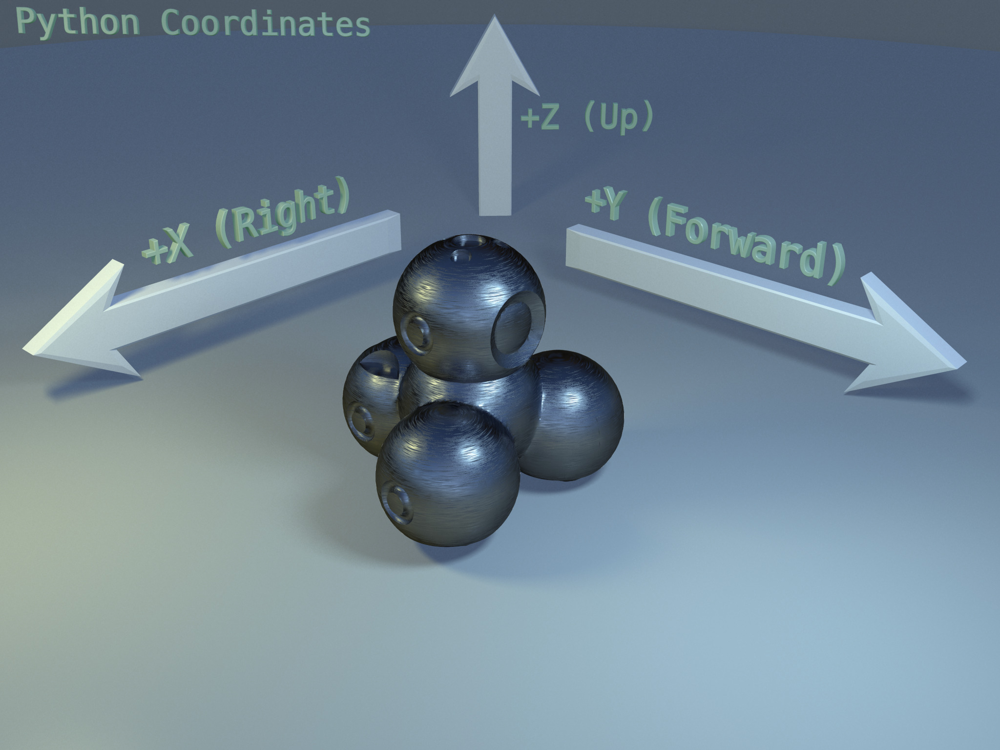
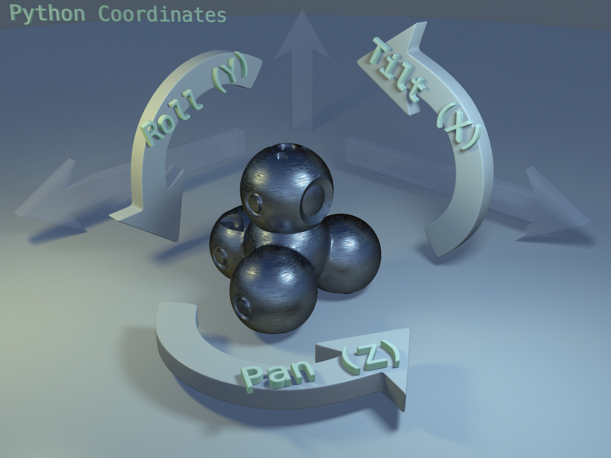

# WonderPyExamples
This is a collection of examples and tutorials for the [WonderPy Python API](https://github.com/playi/WonderPy) for working with WonderWorkshop robots.

# Project Status
At an "Alpha" release. It's ready to be tried out by folks who are willing to live with a few more rough-edges than one would want, and ideally who can provide constructive criticism.

## Known Issues and To-Do's
Please see the to-do list at [WonderPy](https://github.com/playi/WonderPy/blob/master/README.md#known-issues-and-to-dos).


# Setup
## Prerequisites
1. MacOS
2. Familiarity with Git and command-line tools
3. Python 2.7

## Clone or download the repository contents:
* `git clone git@github.com:playi/WonderPyExamples.git`
OR
* download the .zip from [here](https://github.com/playi/WonderPy/archive/master.zip).

## Set up Virtualenv
Using virtualenv will help isolate your python environment for this project so you're using the specified dependencies with the specified versions.

If you don't have virtualenv installed, you can install it using:  
`pip install virtualenv`
    
 0. be in the _WonderPyExamples_ folder.
 
 1. Create the virtualenv setup with Python 2.7  
    `virtualenv --python=/usr/bin/python2.7 --no-site-packages venv`
    
 2. Activate the environment
    `source venv/bin/activate`
    
## Install WonderPy
This will install the WonderPy module and its dependencies.
`pip install -r requirements.txt`

## Confirm
At this point you should be ready to go !  
Again, assuming you are inside the _WonderPyExamples_ folder:
`python tutorial/01_hello_world.py`

# Tutorial Examples
The [_tutorial_ folder](tutorial/) includes examples which are a good place to get the hang of things.  
In lieu of proper documentation, the hope is that this will be a good jumping off point.  
They're reasonably well commented, and aim to do things one step at a time.
### [tutorial/01\_hello\_world.py](tutorial/01_hello_world.py)
A simple example which connects to a robot and plays two greeting sounds and does some simple control of the LEDs.  
This example works with Dash, Dot, or Cue.
### [tutorial/02\_sensors.py](tutorial/02_sensors.py)
Connects to a robot and maps the realtime accelerometer data into Roll and Tilt, and then maps those to control the Hue, Saturation, and Brightness of the robot's color LEDs.  It also uses the realtime button status from the robot to control the pattern on the LED eyering.  
This example works with Dash, Dot, or Cue.
### [tutorial/03\_motors.py](tutorial/03_motors.py)
Connects to a robot, flashes the robot's top button, waits for the top button to be pressed, and then executes a simple driving maneuver with "anticipation" movement in the head as well.  
This example works only with Dash or Cue, because Dot does not drive.  So it also demonstrates querying the robot for whether it has the ability to drive.

# Miscellaneous Examples
The [_misc_ folder](misc) contains a range of examples. Most of them are fairly simple, and intended to illustrate a single aspect of the robots.  The "Sketcher" example is more complex.

### [misc/accelerometer.py](misc/accelerometer.py)
Basic usage of the realtime accelerometer data. Works with all robots.
### [misc/beacon.py](misc/beacon.py)
Simple demonstration of detecting the infrared beacon emitted by other WonderWorkshop robots.  
This does not work with Dot, because Dot has no IR sensor.
### [misc/distance.py](misc/distance.py)
Shows the raw realtime distance/reflectance sensor, and has a simple behavior where the robot will scoot away from objects close to it.  
Only works with Dash and Cue.
### [misc/headPanTilt.py](misc/headPanTilt.py)
Read the robot's head position as a sensor!  
Only works with Dash and Cue.
### [misc/sketcher.py](misc/sketcher.py)
This is a moderately complex example for working with the [SketchKit Accessory](https://store.makewonder.com/pages/sketch-kit).  This example loads an arbitrary (but thoughtfully selected) SVG graphics file, and has the robot physically draw the file's image with the sketchkit pen.  
This example has its own documention, in the file [misc/sketcher.md](misc/sketcher.md).
### [misc/sketchStars.py](misc/sketchStars.py)
A simple example of working with the [SketchKit Accessory](https://www.makewonder.com/dash##accessories).  This example simply draws classic stars.


		
## Robot Connection Options
Upon launching any of the examples, the app will scan for robots for at least 5 and at most 20 seconds.  After scanning, whichever robot had the highest signal strength (RSSI) will be connected to.  This is a reasonable approximation of connecting to the closest robot.

### Connection Options:
```
[--connect-type cue | dot | dash]
  filter for robots of the specified type/s

[--connect-name MY_ROBOT | MY_OTHER_ROBOT | ...]
  filter for robots with the specified name/s
  
[--connect-eager]
  connect as soon as a qualified robot is discovered.  
  do not wait the full scanning period.
  if there are more than one robot with matching criteria,
  the one with the best signal is still selected
  
[--connect-ask]  
  show a list of available robots, and interactively ask for input.
  indicates which has the highest signal strength.
  
``` 

### Connection  Examples:
* Spend 5 seconds looking for all Cue and Dash robots which are named either "sammy" or "sally", and connect to the one with the best signal strength:  
`python tutorial/01_hello_world.py --connect-type cue dash --connect-name sammy sally`  

* Connect ASAP to any robot named 'sally', no matter what type of robot it is.  
`python tutorial/01_hello_world.py --connect-eager --connect-name "sally"`  

# Developing
## PyCharm
At this point, opening the examples in PyCharm should work fairly well.  


# Coordinate Systems
The python API uses a right-handed coordinate system with:

* +X to the right of the robot  (aka Right)  

* +Y in front of the robot (aka Forward)  
  
* +Z above ther robot (aka Up)

* Pan is rotation about +Z (Up),  
  so +Pan is counter-clockwise.
* Tilt is rotation about +X (Right),  
  so +Tilt is up.
* Roll is rotation abount +Y (Forward),
  so +Roll is leaning to the right.
  
| Positions                                | Rotations                                   |
|------------------------------------------|---------------------------------------------|
|  |  |

**Note!**  
The json representation of sensors and commands also uses a right-handed system, but with +X as Forward and +Y as Left, and rotations that follow.  In normal use of the Python API you should not encounter this coordinate system tho.

# Units
The python API uses these units:

* Distances are in Centimeters
* Angles are in Degrees
* Times are in Seconds
* Brightnesses are in [0, 1]

# Contribute
Please check the list of issues and todo's at the [WonderPy repository on github](https://github.com/playi/WonderPy/issues).  
Pull-Requests are welcome.  
Feature requests for the API should also be sent as a [new Issue in github](https://github.com/playi/WonderPy/issues).  

# Get Help
### Report Bugs
If there's a specific bug or problem with the API, please check the [outstanding issues in github](https://github.com/playi/WonderPy/issues) and if it's not already covered, create a new one.  

### Ask for Advice
If you have a more general question such as "how would I approach doing .." or you have a tip you'd like to share, please visit [stackoverflow](https://stackoverflow.com/) and be sure to tag your post with **wonderworkshop**.

# Sharing your work ?
Got a great picture or video ?  
If you're sharing your Dash, Dot or Cue work on [Twitter](https://twitter.com/WonderWorkshop) or [Instagram](https://www.instagram.com/wonderworkshop/), remember to tag **@WonderWorkshop** !
